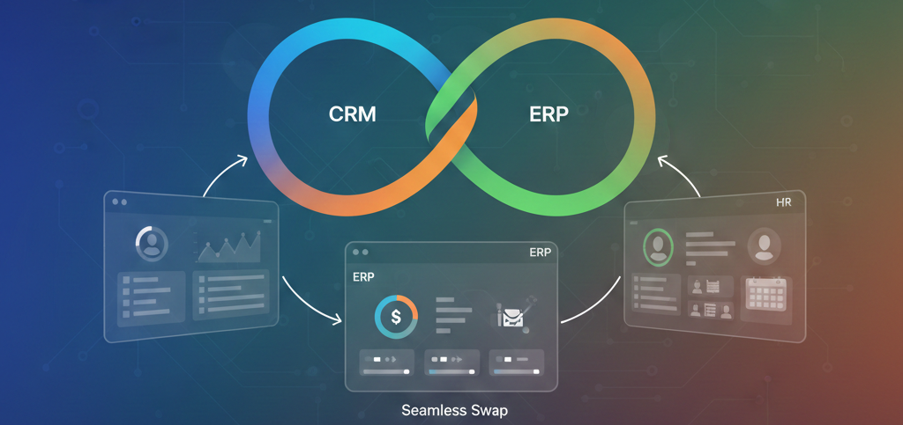

# 🚀 unisync · HR · CRM Suite
---


---


A **modular unisync suite** with integrated **HR and CRM** functionality.  
Built using **React + Vite** on the frontend and **Node.js + Express** on the backend, with **Supabase-ready PostgreSQL schemas** for fast database provisioning.

Designed for learning, rapid prototyping, and extending into production-grade systems.

---

## 📌 Overview

This repository provides a compact yet extensible unisync system covering core enterprise needs such as:

- Human Resources  
- Customer Relationship Management  
- Inventory and Suppliers  
- Accounting and Quality checks  

The architecture focuses on:

- Clear separation of concerns  
- Component-driven UI  
- Simple, extensible backend APIs  

---

## ✨ Features

### 📊 Dashboard
- Cross-module summary cards
- Charts and KPIs scaffolded for extension

### 🤝 CRM
- Leads, contacts, deals, organizations
- Notes and activity tracking
- CRUD-ready API routes

### 🧑‍💼 HR
- Employee directory
- Attendance and payroll (scaffolded)
- Performance and role management pages

### 📦 Inventory
- Stock catalog
- Quantity adjustments
- Optional transaction history

### 🏭 Suppliers & Buyers
- Supplier and buyer CRUD
- Search and contact detail views

### 💰 Accounting
- Basic receivables and payables
- Reporting skeleton for future expansion

### ✅ Quality
- Inspection records
- Status and scoring system

---

## 🛠 Tech Stack

### Frontend
- React (Vite)
- Tailwind CSS
- Recharts
- lucide-react

### Backend
- Node.js
 - Express
- Express.js

### Database
- Supabase (PostgreSQL)
- SQL schema files included

### Dev Tooling
- Vite dev server
- npm scripts

---

## ⚡ Quick Start

### Prerequisites
- Node.js 16+
- npm or yarn
- Git
- Supabase account (optional but recommended)

---

### 📥 Clone the Repository

```bash
git clone https://github.com/OneTeraByte7/ERP-HR-CRM-Suite.git
cd ERP-HR-CRM-Suite
```

### ▶️ Run Frontend
```bash
cd client
npm install
npm run dev


Open the URL shown by Vite
(default: http://localhost:5173)
```

### ▶️ Run Backend
```bash
cd server
npm install
npm run dev


Default backend URL:
http://localhost:3000
```

### 🔐 Environment Variables
```bash
Create a .env file inside server/:

SUPABASE_URL=your_supabase_project_url
SUPABASE_KEY=your_supabase_key
PORT=3000


See server/utils/supabaseClient.js for exact usage.
```

### Available Schemas

crm_schema.sql — CRM tables and policies
hr_schema.sql — HR-related tables

### Setup Steps

Create a new Supabase project
Open the SQL editor
Paste and run each schema file
Verify tables are created successfully

### Notes

UUIDs are generated using gen_random_uuid()
Timestamps default to now()
RLS policies are included for CRM (review before production use)

### 📁 Project Structure
```bash
ERP-HR-CRM-Suite/
│
├── client/                  # React + Vite frontend
│   ├── src/
│   │   ├── components/      # Shared UI components
│   │   ├── pages/           # Feature-based pages
│   │   └── routes/
│
├── server/                  # Express backend
│   ├── controllers/         # Request handlers
│   ├── routes/              # API routes
│   ├── utils/               # Helpers (Supabase client, etc.)
│   └── supabase/            # SQL schemas
│
└── README.md

```